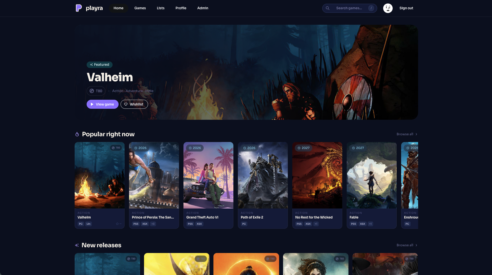
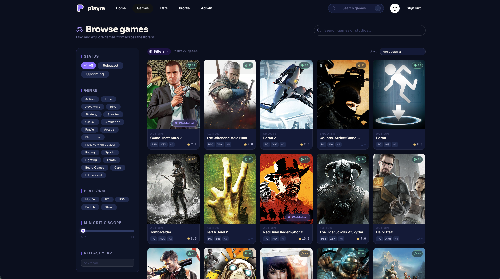
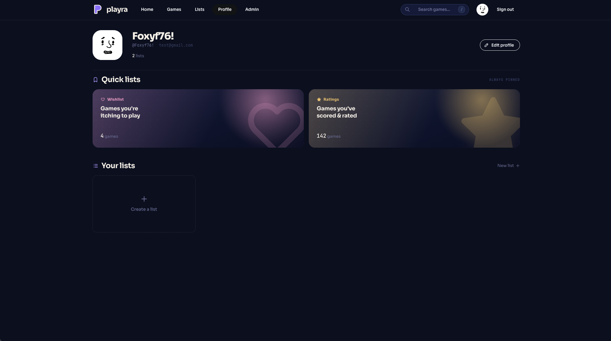
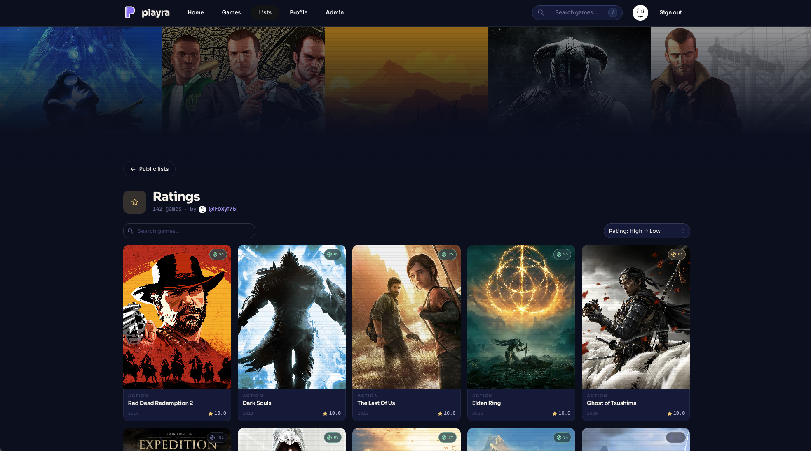

# Playra

Frontend for Playra, a game tracking app. Browse a large game library, rate what you've played, keep a wishlist, and put together public lists.



## Features

- Browse games with filters for status, genre, platform, critic score and release year
- Search by game or studio, with a `/` shortcut for the global search
- Rate games and keep a wishlist
- Create custom lists, sort and search within them
- Ratings, wishlists and lists can be made public
- Admin section for managing content







## Stack

- React 19 and TypeScript
- Vite, with the React Compiler enabled
- TanStack Router (file-based routes) and TanStack Query
- Mantine for UI components
- Supabase for auth
- Axios for talking to the backend API
- Zod for validation

## Getting started

You'll need Node.js and a running instance of the Playra API.

```sh
npm install
```

Create a `.env.local` in the project root:

```
VITE_API_URL=
VITE_SUPABASE_URL=
VITE_SUPABASE_PUBLISHABLE_KEY=
```

Then start the dev server:

```sh
npm run dev
```

## Scripts

| Command           | Description                          |
| ----------------- | ------------------------------------ |
| `npm run dev`     | Start the Vite dev server            |
| `npm run build`   | Type check and build for production  |
| `npm run preview` | Serve the production build locally   |
| `npm run lint`    | Run ESLint                           |

## Project layout

```
src/
  features/   Feature modules (admin, auth, games, lists, profile, shared)
  routes/     File-based routes for TanStack Router
  lib/        API client, Supabase client, route guards
  styles/     Global CSS
```

Each feature folder holds its own `api`, `hooks` and `components`. `src/routeTree.gen.ts` is generated by the router plugin, so don't edit it by hand.
